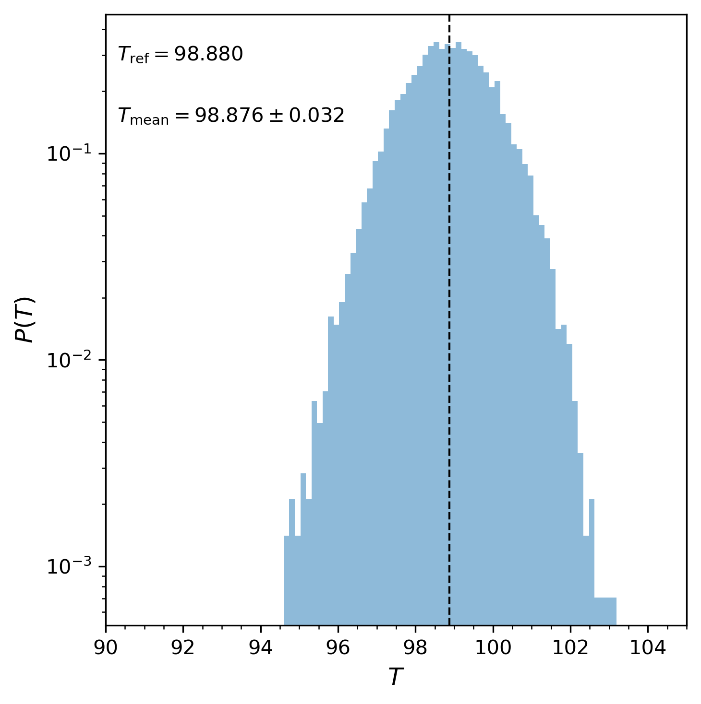

# Canonical Sampling through Velocity Rescaling Thermostat in OpenMM

An implementation of the [CSVR/Bussi-Donadio-Parrinello thermostat](https://pubs.aip.org/aip/jcp/article/126/1/014101/186581/Canonical-sampling-through-velocity-rescaling) in OpenMM, along with a WCA system for testing.

## Installation

```console

python -m pip install .

```

or move the `csvr.py` file and import as needed.

## Example temperature distribution

Below example is from running the `run.py` file in `scripts/`.


